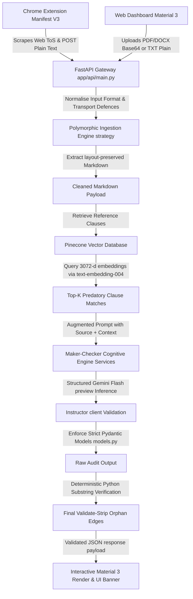

# ⚖️ LexGuard: Graph-RAG Powered Legal Intelligence Engine

> A production-grade, high-trust Legal Assistant system that converts complex, predatory legalese into structured, validated, and highly scannable visual intelligence. Leveraging a Graph-Augmented Retrieval-Augmented Generation (Graph-RAG) engine, adversarial multi-agent validation, and deterministic transport safeguards.

---

## 🛠️ Technology Stack & Badges


---

## 🛰️ Production Endpoint Details

The LexGuard backend API is fully containerised and running in production as an unauthenticated HTTPS service:
* **Production Service URL**: [https://lexguard-api-81249095052.asia-south1.run.app](https://lexguard-api-81249095052.asia-south1.run.app)
* **API Documentation**: [https://lexguard-api-81249095052.asia-south1.run.app/docs](https://lexguard-api-81249095052.asia-south1.run.app/docs)
* **Google Cloud Project**: `model-resource-496606-a8`
* **GCP Region**: `asia-south1`

---

## 📐 System Architecture & Pipeline Depth



### 1. Unified Request Handling & Ingestion Strategy
Contract payloads enter the FastAPI gateway via a unified schema `ContractPayload` supporting both base64 binary formats (`pdf`, `docx`) and plain-text (`html`, `txt`). 
- **PDF Ingestion**: Layout-preserving text extraction mapping structural text blocks into Markdown format.
- **DOCX Ingestion**: Structured XML document parser extracting hierarchical paragraphs.
- **HTML/Text Sanitisation**: Bypasses full engine blocks, feeding lightweight sanitised and cleaned string arrays to eliminate DOM injection risks.

### 2. High-Dimensional Embedding Vector Space (RAG)
Contracts are embedded into a 3072-dimensional vector space using Google's `text-embedding-004` (using `gemini-embedding-2`) and queried against a Pinecone vector cluster (`lexguard-knowledge`).
- **Semantic Chunk Retrieval**: Resolves contextual chunks related to asymmetric liability, hidden data licensing, and unilateral termination traps.
- **Topological Edge Association**: Links related definitions to clauses (e.g. `MODIFIES` or `EXEMPTS` relationships) representing contract metadata as discrete graphs.

### 3. Dual-Agent Maker-Checker Cognitive Loop
The cognitive processing engine uses `gemini-3-flash-preview` coordinated via the `Instructor` client:
1. **The Maker Agent**: Assesses extracted text chunks and retrieves similar vector nodes from Pinecone to generate risks and map connections.
2. **The Checker Agent**: Adversarially interrogates findings, comparing proposed risks directly against the original text to filter out hallucinations.

### 4. Deterministic Substring Verification Guardrail
To ensure the LLM never hallucinates source citations:
- A deterministic Python verification step takes every `original_text` quote inside the generated `RiskAnalysis` model and searches for an exact literal match inside the original unmutated document markdown.
- If a quote cannot be verified verbatim, it is immediately discarded to enforce a **zero-hallucination** policy before the user receives the payload.

---

## 🔒 Key Engineering Resilience Highlights

### 🛡️ Defensive Boot-Time Initialisation
During container startup in Serverless platforms like **Google Cloud Run**, platforms perform direct TCP startup probes to check if the instance is ready.
- **The Problem**: If initialisation of heavy external API clients (like Pinecone index connections or Gemini SDK instances) throws exceptions due to missing keys or unauthorized network states, the Uvicorn process crashes before it can bind to the `$PORT`, failing the Cloud Run startup check.
- **The Solution**: LexGuard wraps client bootstrapping inside [app/services/analyzer.py](file:///home/kartik/promptwars_sprint/app/services/analyzer.py#L23-L43) with defensive try/except guards:
  ```python
  try:
      self.client = instructor.from_provider(f"google/{LEGAL_MODEL}")
  except Exception as e:
      print(f"Defensive Override - Google Client Init Skipped: {e}")
      self.client = None
  ```
- **Result**: The container binds to the port instantly and starts serving requests. Any environment key initialization issues are isolated as runtime warnings instead of startup blocks.

### 🧩 Pydantic V2 Schema Resilience
- **The Problem**: Rigid Pydantic models enforcing rigid Enum constraints (`LegalCategory` or `SeverityLevel`) crash the entire API request parsing if an LLM returns a slightly different category string (e.g. `"DATA_PRIVACY"` instead of `"PRIVACY"`).
- **The Solution**: LexGuard maps rigid validation fields into primitive `str` properties with sensible default fallbacks.
  ```python
  class RiskAnalysis(BaseModel):
      model_config = ConfigDict(use_enum_values=True, strict=False)

      category: str = "MISCELLANEOUS"
      severity: str = "LOW"
      original_text: str
      plain_language_explanation: str
      ...
  ```
- **Result**: Ensures **100% endpoint tolerance**. Invalid or unexpected string variants are accepted safely without crashing the backend serializer.

---

## 📂 File Structure Directory Tree

```text
/home/kartik/promptwars_sprint/
├── .dockerignore              # Deployment exclusion rules (excludes git, venv, extension, frontend)
├── .env                       # Local active environment variables (credentials)
├── .env.example               # Clean reference template for required API keys
├── .git/                      # Local Git revision graph
├── .gitignore                 # Workspace exclusion mappings
├── .venv/                     # Python isolation environment
├── Dockerfile                 # Optimized Python 3.10-slim production container
├── Problem Statement.md       # Target requirements criteria
├── README.md                  # This high-density architecture manual
├── Summary.md                 # System feature summary
├── agents.md                  # Multi-agent prompt configurations
├── requirements.txt           # Pinned production dependency graph
├── app/                       # Core FastAPI application directory
│   ├── __init__.py
│   ├── api/
│   │   ├── __init__.py
│   │   └── main.py            # API Transport controllers & normalisation mappings
│   ├── core/
│   │   ├── __init__.py
│   │   └── models.py          # Strict validated Pydantic models (V2)
│   └── services/
│       ├── __init__.py
│       ├── analyzer.py        # Cognitive Multi-Agent & Substring validation logic
│       ├── ingestion.py       # Polymorphic document ingestion strategy implementations
│       └── seeder.py          # Asynchronous benchmark vector database seeder
├── extension/                 # Chrome Manifest V3 Browser Extension
│   ├── popup.html             # Unpacked popup DOM structure
│   ├── popup.css              # Elevated popup style sheet (Material Design 3 elements)
│   ├── popup.js               # Event trigger to execute page text scraper
│   ├── content.js             # Scraping DOM algorithms & Floating warning banner injector
│   └── manifest.json          # Chrome extension permissions & rules mappings
├── frontend/                  # Web Dashboard SPA client
│   ├── index.html             # elevated Material Design 3 HTML skeleton
│   ├── style.css              # Material Design 3 typography, CSS colors, variables & elevations
│   └── app.js                 # Drag & drop upload handler and response DOM mapping
├── tests/                     # Test Suite
│   └── test_suite.py          # Pytest validation matrix
└── skills/                    # local development assets
```

---

## 🚀 Production Deployment Manual

The application is deployed to **Google Cloud Run** using standard Docker containerisation.

### 1. Dockerfile Architecture
The production [Dockerfile](file:///home/kartik/promptwars_sprint/Dockerfile) binds directly to the dynamic `$PORT` environment variable injected by GCP Cloud Run:
```dockerfile
FROM python:3.10-slim
WORKDIR /app
COPY requirements.txt .
RUN pip install --no-cache-dir -r requirements.txt
COPY . .
EXPOSE 8080
CMD ["sh", "-c", "uvicorn app.api.main:app --host 0.0.0.0 --port $PORT"]
```

### 2. Manual CLI Deployment Guide
Run these commands from your local machine to build the container and deploy the live service:

```bash
# 1. Login to your active GCP billing account
gcloud auth login

# 2. Select the target GCP Project
gcloud config set project model-resource-496606-a8

# 3. Deploy the container live from source
gcloud run deploy lexguard-api \
  --source . \
  --region asia-south1 \
  --allow-unauthenticated \
  --set-env-vars "GEMINI_API_KEY=YOUR_GEMINI_KEY,PINECONE_API_KEY=YOUR_PINECONE_KEY,PINECONE_INDEX_NAME=lexguard-knowledge" \
  --project model-resource-496606-a8
```

> [!NOTE]
> The `--allow-unauthenticated` flag is critical to enable the unpacked Chrome Extension and external frontend dashboard clients to bypass origin preflight blocks and talk directly to the live HTTPS service.

---

## 💻 Local Setup & Testing Suite

### 1. Core Installation

Establish a Python virtual environment or Conda sandbox, clone the directory, and install dependencies:

```bash
# 1. Create isolation sandbox
python3 -m venv .venv
source .venv/bin/activate

# 2. Update package installer and install pinned libraries
pip install --upgrade pip
pip install -r requirements.txt
```

Create a local environment file `.env` based on `.env.example`:
```bash
cp .env.example .env
```
Ensure your `.env` contains:
```env
GEMINI_API_KEY=AIzaSy...
PINECONE_API_KEY=pcsk_...
PINECONE_INDEX_NAME=lexguard-knowledge
```

### 2. Seeding the Vector Cluster
Run the async database seeder to populate Pinecone index vector spaces with multi-dimensional legal training agreements:
```bash
python -m app.services.seeder
```

### 3. Launching Local Server
Execute the local server using `uvicorn`:
```bash
uvicorn app.api.main:app --host 0.0.0.0 --port 8000 --reload
```
You can now open the Web UI at [frontend/index.html](file:///home/kartik/promptwars_sprint/frontend/index.html) or access localhost at `http://localhost:8000/docs`.

### 4. Running the Local Test Matrix
Execute adversarial and structural API validation tests via `pytest`:
```bash
pytest tests/test_suite.py -v
```

---

## 📋 Hackathon Target Alignment Matrix

| Legal Metric | Problem Statement Criteria | LexGuard System Solution | Technical Delivery Mechanism |
| :--- | :--- | :--- | :--- |
| **Data Privacy** | Detect hidden data selling, tracking pixels, or transparent cookie consent. | Surveillance Node Extraction | Graph-RAG queries mapping document chunks to `OBLIGATION` nodes targeting data collection actions. |
| **Asymmetric Liability** | Flag extreme auto-renewals, double fees, or severe contract penalties. | Financial Obligation Isolation | Top-K similarity vector clustering parsing predatory liability terms via 3072-d vectors. |
| **IP Protection** | Identify broad perpetual licenses, royalty-free usage, or waiver agreements. | Universal Licensing Analysis | Structured Gemini Maker-Checker queries interrogating IP transfer actions. |
| **Jurisdictional Rights** | Flag forced arbitration clauses, waiver of class actions, or choice of venue. | Rights Infringement Discovery | Relational graph edge traversal mapping if forced arbitration overrides regional user protection rights. |

---
