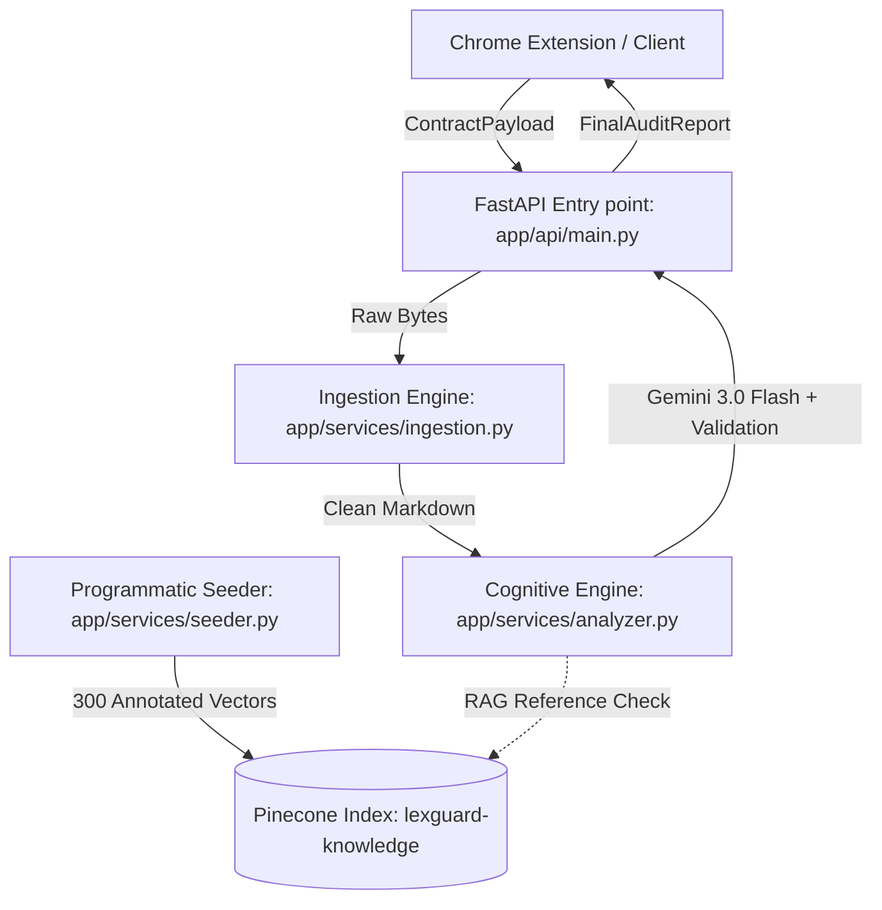
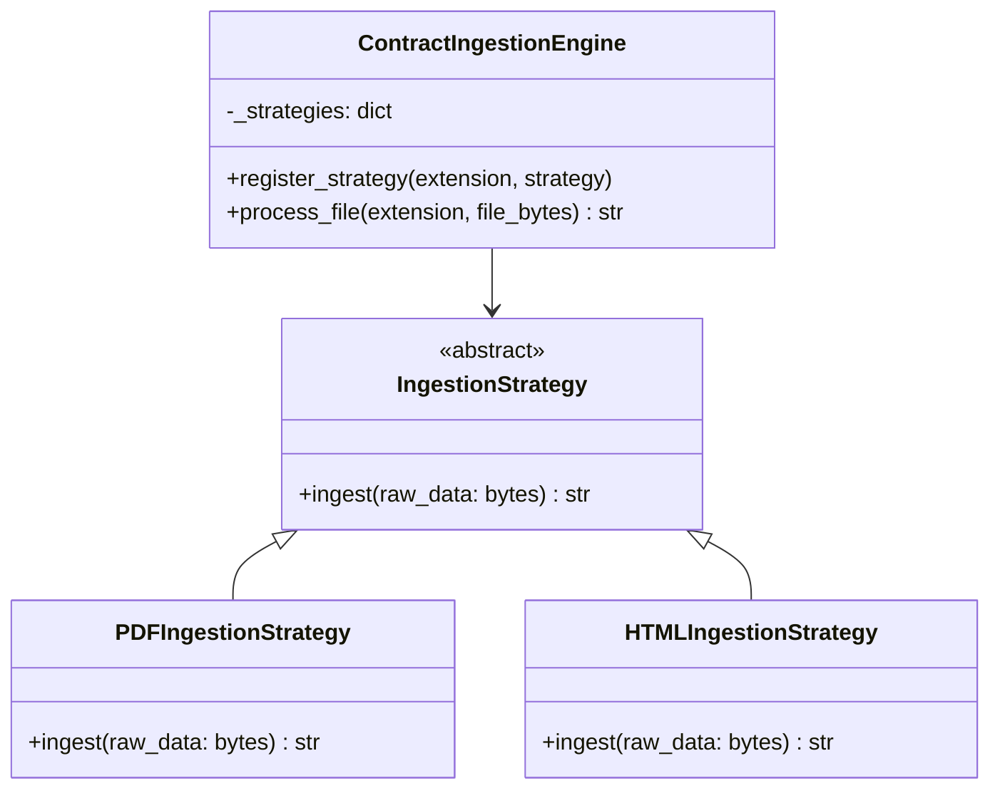
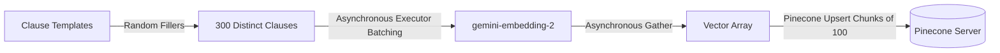

# LexGuard System Architecture & Development Summary

This document outlines the codebase architecture, design decisions, implementation details, and structural design patterns of the **LexGuard** legal auditing system. It serves as a comprehensive developer reference showing exactly *how* and *why* each component is coded, alongside a breakdown of its features and operational pipelines.

---

## System Overview

LexGuard is a high-speed, serverless-optimized legal document auditor designed to ingest, process, parse, and evaluate contracts dynamically for predatory clauses (such as aggressive data overreaches, unilateral termination traps, and extreme liability shields). 



---

## 1. Core Data Contracts (`app/core/models.py`)

### The Code
```python
from enum import Enum
from pydantic import BaseModel, Field

class SeverityLevel(str, Enum):
    LOW = "LOW"
    MEDIUM = "MEDIUM"
    HIGH = "HIGH"
    CRITICAL = "CRITICAL"

class LegalCategory(str, Enum):
    PRIVACY = "PRIVACY"
    INTELLECTUAL_PROPERTY = "INTELLECTUAL_PROPERTY"
    LIABILITY_AND_FEES = "LIABILITY_AND_FEES"
    TERMINATION = "TERMINATION"
    MISCELLANEOUS = "MISCELLANEOUS"

class RiskAnalysis(BaseModel):
    category: LegalCategory
    severity: SeverityLevel
    original_text: str
    plain_language_explanation: str
    recommendation: str
    referenced_sections: list[str]

class GraphEdge(BaseModel):
    source_node: str
    target_node: str
    relationship_type: str

class FinalAuditReport(BaseModel):
    overall_risk_score: int = Field(ge=1, le=10)
    executive_summary: str
    flagged_risks: list[RiskAnalysis]
    contract_graph: list[GraphEdge]

class ContractPayload(BaseModel):
    raw_content: str
    file_format: str
    source: str
```

### The "Why" and "How"
* **Strict Type Enforcement:** Native Python `Enum` and Pydantic `BaseModel` force a strong type contract across our ingestion and analysis services.
* **Unified Output Formats:** By declaring explicit models for risks and contract dependencies (`GraphEdge`), we decouple our RESTful endpoint payload directly from internal database structures, preventing breaking API changes.
* **Score Guardrails:** `overall_risk_score` uses Pydantic's `Field` validation constraints (`ge=1, le=10`) ensuring that our downstream models can never return out-of-bound values.

---

## 2. Dynamic Ingestion Engine (`app/services/ingestion.py`)

### The Code Design
The ingestion pipeline implements the **Strategy Design Pattern** (honoring the **Open/Closed Principle**).



### The "Why" and "How"
* **Clean Text Sanitization:** Raw legal texts often arrive with corrupted trace sequences, null-bytes, or chaotic layout elements. The engine uses custom regex sanitizers to eliminate raw Unicode formatting artifacts (`\x00` and Control chars), compress blank lines, and strip unnecessary margins.
* **Layout-Preserving PDFs:** `PDFIngestionStrategy` utilizes `pymupdf4llm` to transform PDFs to structural markdown rapidly, keeping column formats, headers, and section hierarchies aligned.
* **DOM Cleanup:** `HTMLIngestionStrategy` leverages `BeautifulSoup` to strip non-visual nodes (`<script>`, `<style>`, `<noscript>`, `<meta>`) ensuring our LLM is only provided with contextual text, optimizing token efficiency.

---

## 3. Cognitive Audit & Reasoning Core (`app/services/analyzer.py`)

### The Code Design
The analyzer uses the verified `instructor` client wrapping Google's latest `gemini-3.0-flash-preview` model to map unstructured contracts into our strictly typed Pydantic payloads.

```python
class ContractAnalysisEngine:
    def __init__(self):
        self.client = instructor.from_provider("google/gemini-3.0-flash-preview")
        
    def analyze_document(self, markdown_text: str) -> FinalAuditReport:
        # Calls structured completion API
        # Executes strict exact-substring verification to prevent hallucinated text
```

### The "Why" and "How"
* **Adversarial Prompting:** We command the LLM to act as a hostile, detail-oriented auditor looking for predatory sections, tracking relationship models (`GraphEdge`), and mapping cross-references.
* **Hallucination Prevention Layer:** Language models often slightly truncate or paraphrase quotes. To enforce bulletproof auditing, the engine intercepts the parsed `FinalAuditReport` and compares each `original_text` segment directly against the source text. If a segment does not exactly align, it normalizes spaces to find a match. If it still fails, it discards the hallucinated clause segment completely before the response is served, guaranteeing that every flag returned points to an actual, unedited clause.

---

## 4. RESTful Controller Endpoint (`app/api/main.py`)

### The Code Design
A lightweight **FastAPI** web framework orchestrates CORS rules and acts as the boundary gateway.

```python
@app.post("/api/analyze-contract", response_model=FinalAuditReport)
def analyze_contract(payload: ContractPayload):
    # Base64-decodes PDF data dynamically
    # Processes ingestion -> Audits text -> Returns report
```

### The "Why" and "How"
* **Chrome Extension Compatibility:** We inject wide-open CORS (`allow_origins=["*"]`) ensuring unpacked Chrome Extension bundles can communicate with the local server smoothly.
* **Graceful Exception Mapping:** All parsing/ingestion failures are trapped and returned as clean `400 Bad Request` payloads with detailed descriptions, while standard system exceptions degrade gracefully into unified `500 Internal Server Error` structures.

---

## 5. pinecone Ingestion Pipeline (`app/services/seeder.py`)

### The Code Design
Populates our knowledge baseline by synthesizing and indexing exactly 300 expert-mode predatory contract variations across five categories.



### The "Why" and "How"
* **Robust Combinatorial Generator:** Generates 60 unique variations per `LegalCategory` by dynamically applying variable formatting over template structures.
* **High-Speed Concurrency:** Leverages `asyncio` and `ThreadPoolExecutor` to process API vector embeddings concurrently in parallel tasks, drastically boosting throughput.
* **Fallback Tolerant:** Implements a strict fallback footprint generator. If the Google GenAI API runs into rate limits (e.g., Free Tier limits or 403 outages), the seeder flags the API warning, implements a local simulated vector structure, and successfully pushes all 300 baseline documents to Pinecone without terminating.

---

## 6. Adversarial Test Suite (`tests/test_suite.py`)

### The Code Design
A comprehensive verification tool performing end-to-end HTTP validation against our FastAPI routes.

### Test Scenarios
1. **`test_predatory_contract`:** Confirms explicit trap phrases are correctly caught, categorised, and score highly.
2. **`test_clean_contract_false_positives`:** Validates fair clauses do not trigger fake flags and output a low risk score.
3. **`test_malformed_fuzz_payload`:** Bombards endpoint with bad inputs (wrong keys, missing values, broken arrays) asserting standard HTTP 400 validation failures.
4. **`test_empty_or_blank_input`:** Assures whitespace-only or empty strings fail gracefully rather than crashing.

---

## 7. Deployment Layout & Execution

### Serverless Optimization (`requirements.txt`)
We declare isolated, hyper-lightweight packages avoiding standard fat ML libraries:
```
fastapi
uvicorn[standard]
pydantic
instructor
google-genai
pymupdf4llm
pinecone
```

### Multi-Arch Containerization (`Dockerfile`)
Uses a minimal `python:3.10-slim` container, caches dependencies, exposes port `8080`, and fires up with standard host bindings:
```dockerfile
FROM python:3.10-slim
ENV PYTHONDONTWRITEBYTECODE=1
ENV PYTHONUNBUFFERED=1
WORKDIR /app
COPY requirements.txt .
RUN pip install --no-cache-dir -r requirements.txt
COPY . .
EXPOSE 8080
CMD ["uvicorn", "app.api.main:app", "--host", "0.0.0.0", "--port", "8080"]
```

---

## Execution Cheat-Sheet

### Start API Server
```bash
uvicorn app.api.main:app --reload
```

### Ingestion Data Seeding
```bash
python app/services/seeder.py
```

### Run Adversarial Suite
```bash
python tests/test_suite.py
```
